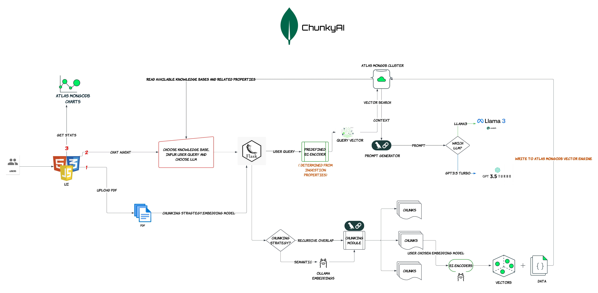

# ChunkyAI - Gen-AI Playground

**ChunkyAI** is an application designed to test RAG (Retrieval-Augmented Generation) models. It is highly intuitive and facilitates testing multiple models, chunking strategies, and LLMs (Large Language Models) to help determine which combination yields the most accurate results for your use case. Use it to fine-tune your bot and improve its performance.

## Python Version

The application is developed and tested using the following Python version:

```bash
chunkyAI % python --version
Python 3.12.8
```

## For Local LLM

To run a local LLM, follow these commands:

```bash
ollama run llama3
ollama serve
ollama pull mxbai-embed-large
ollama pull nomic-embed-text
```

## For Code Installation

Install required dependencies using:

```bash
pip3 install -r requirements.txt
```

## For Config

Create a configuration file similar to `config_dummy` to set up the necessary parameters for your environment.

## Chunking Strategy (Optional)

We are not using splitting tokenizers to align chunking with a particular LLM. However, you can choose to implement it yourself. Below is a snippet for the `RecursiveCharacterTextSplitter`:

```python
# splitter = RecursiveCharacterTextSplitter.from_tiktoken_encoder(
#    encoding_name="cl100k_base", # Optimized for GPT-4, 3.5
#    chunk_size=chunk_size,
#    chunk_overlap=chunk_overlap,
#    separators=separators,
# )
# return splitter.split_documents(docs)
```

## To Run the Application

To run the application, execute the following:

```bash
python app.py
```

## MongoDB Setup

- Create a collection in MongoDB and add the vector indexes provided in the files :

--nomic_vector_index.json
--mxbai_vector_index.json

you can also use langchain to create these indexes for you.

## Architecture Diagram

<br>

## APP SHOULD LOOK LIKE

[](https://www.youtube.com/watch?v=1xYrQcAfvVg)

->Upload Page
<br>

->Chat Page
<br>

->Stats Page [FYI you need to use MongoDB charts for below data]
<br>


## Support for Images and Tables

Currently, the application does not have capability to vectorize images and tables inside the pdf documents. However, you can refer to the following resources to implement support for them:

- [YouTube Video: PDF Parsing with Complex Tables](https://www.youtube.com/watch?v=FZFB92UnXQ4)
- [GitHub: Example of Parsing PDF with Complex Tables](https://github.com/rajib76/langchain_examples/blob/main/examples/how_to_parse_pdf_with_complex_tables.py)

## TODO
- [ ] Support for getting data URLs not pdf's alone.
- [ ] Pure agentic RAG and auto fine tune prompts.
- [ ] Semantic Cache.
- [ ] Chat History.
- [ ] Quantization 

For chat history and agent integration, you can explore:
- [MongoDB Atlas Agent with Langchain](https://www.mongodb.com/developer/products/atlas/agent-fireworksai-mongodb-langchain/)
- [Choose Embedding Model for RAG](https://www.mongodb.com/developer/products/atlas/choose-embedding-model-rag/)

## Useful Resources

Here are some of the resources I used while developing ChunkyAI:

- [Leveraging MongoDB Atlas Vector Search in Langchain](https://www.mongodb.com/developer/products/atlas/leveraging-mongodb-atlas-vector-search-langchain/)
- [Ollama Langchain Integration](https://python.langchain.com/docs/integrations/text_embedding/ollama/)
- [QA with RAG](https://python.langchain.com/docs/how_to/#qa-with-rag)
- [MongoDB Atlas Vector Store Integration](https://python.langchain.com/docs/integrations/vectorstores/mongodb_atlas/)
- [RAG with OpenAI and MongoDB Atlas](https://www.mongodb.com/developer/products/atlas/rag-atlas-vector-search-langchain-openai/)
- [Running Llama 3 Locally](https://www.datacamp.com/tutorial/run-llama-3-locally)
- [Semantic Chunking in Langchain](https://python.langchain.com/docs/how_to/semantic-chunker/)
- [Analyzing Unstructured PDF Data with Embedding Models and LLMs](https://towardsdatascience.com/analyzing-unstructured-pdf-data-w-embedding-models-and-llms-f83ae9a57c2b)
- [Langchain PDF Document Loader](https://python.langchain.com/docs/how_to/document_loader_pdf/)
- [OpenAI Python API](https://github.com/openai/openai-python)
- [RAG Tutorial v2 Query Data](https://github.com/pixegami/rag-tutorial-v2/blob/main/query_data.py#L18)
- [MTEB Leaderboard](https://huggingface.co/spaces/mteb/leaderboard)
- [Awesome Multimodal Large Language Models Evaluation](https://github.com/BradyFU/Awesome-Multimodal-Large-Language-Models/blob/Evaluation/README.md)
